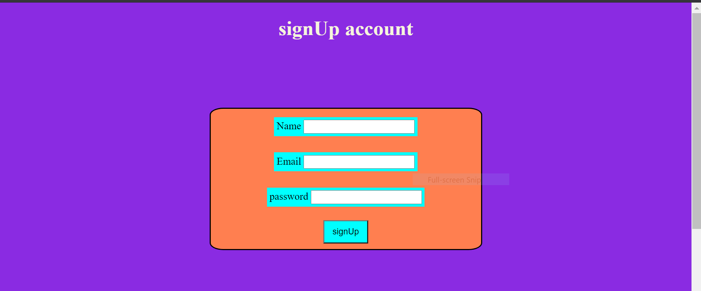
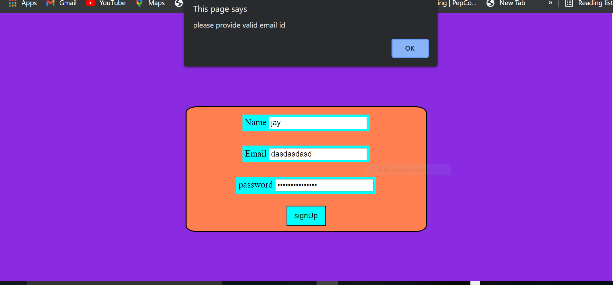
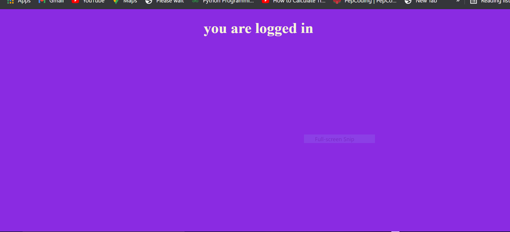
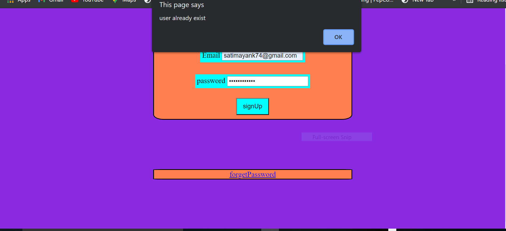
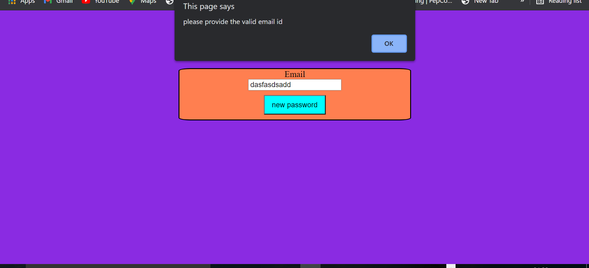
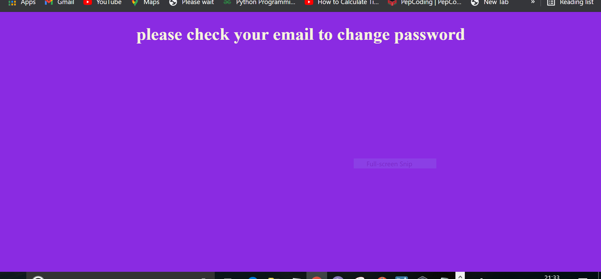
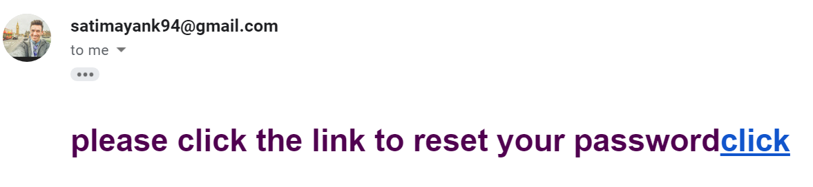
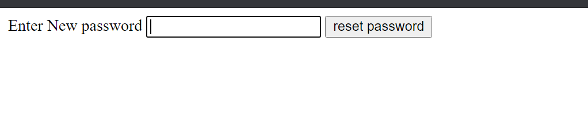
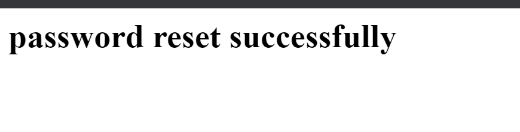

# images to demonstrate the product
1. first you have to install all the dependecy in node_modules by using npm i
2. and after that do (npm start) to run the server
# 3. dependency contains bcrypt, cors, dotenv, express, jsonwebtoken, nodemailer, pg, pg-hstore, sequelize

4.front page look like

5.if providing invalid email that is not exist then nodemailer gives invalid

6.if provide corect then nodemailer accept

7.if again provide same email then database model findOne email

8. if press forget password and then provid invalid email again nodemailer check it

9.if provide corect then you have to check your email and click the link

10. then enter new password and paswoord changes with the help of hash runtime token

